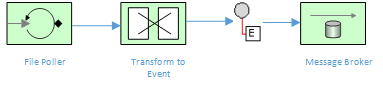

Extract Transform Load (ETL) in Fuse
=======================================

This project demonstrates a simple Extract Transform Load (ETL) workflow to convert a flat-file CSV to an XML Event message

The Camel routes used in this example are explained by the following diagram:

Setup
==============================

You should probably set up the basic developer tools to be able to go through these steps, examples. We will also cover more ideal workflows with developer-local setup of docker and openshift, so would be good to install the "optional" tools as well!

- Install JBoss Developer Studio 9.1.0 GA [https://www.jboss.org/products/devstudio.html]
- Install Apache Maven 3.2.x [http://maven.apache.org]
- Install JBoss Fuse  6.2.1 [https://www.jboss.org/products/fuse.html]

Java Build & Run
==============================

### Build this project

> <project home> $ mvn clean install

## Running locally
Startup Fuse in the background so that we have a local A-MQ broker running.  Via the command-line, you should be able to run this project locally using mvn, and it should work as expected:

>  mvn camel:run

## Running on JBoss Fuse
You will need to install this example first:
  
> mvn install

Install into Fuse with:

> features:addurl mvn:com.redhat/use-case-two/1.0.0/xml/features

> features:install use-case-two

And you can see the application running by tailing the logs

  log:tail

And you can use ctrl + c to stop tailing the log.

## Other ETL Examples

For a more comprehensive example of an ETL use case with Camel, please refer to [http://camel.apache.org/etl-example.html]

Getting Help
============================

If you hit any problems please let the Fuse team know on the forums
  [https://community.jboss.org/en/jbossfuse]
